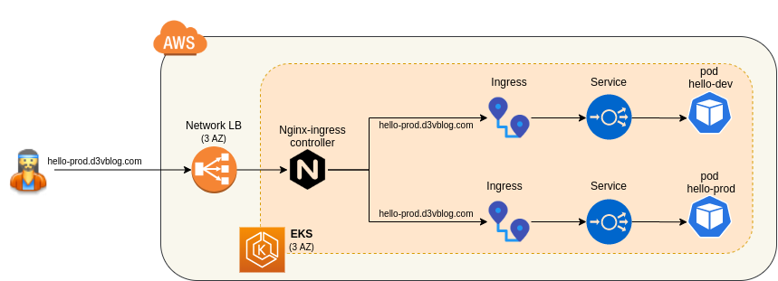

# MyApp: HA container in EKS (AWS managed kubernetes)

## Overview

This setup will deploy an EKS cluster in AWS, using CloudFormation. In this cluster, we will deploy a simple helloworld container, with automatic CI/CD from AWS PipeLine.

More info: you can find an overview of that setup on my [blog](https://greg.satoshi.tech/eks)

### Infra


- Cloud: AWS
- [EKS](https://aws.amazon.com/eks): managed Kubernetes container orchestrator (on 3 availability zones for redundancy)
- [ECR](https://aws.amazon.com/ecr): container registry to store hello image
- App: a simple hello world in nodejs (folder `hello`)
- Code source: Github
- Deployment: [Terraform](https://www.terraform.io/) describes all components to be deployed. One command line will setup the infra
- CI/CD: [Codepipeline](https://aws.amazon.com/codepipeline) to build and deploy the app in EKS


### CI/CD flow diagram


A simple `git push` from a developer in Github will launch the whole CI/CD process. Docker image will build and containers in EKS will be updated to run that new image without any downtime.

## Deploy

### Prerequisites
Please setup on your laptop:
- AWS cli and AWS account to deploy in `eu-west-1`
- Docker and Compose
- Github personal token with `admin:repo_hook, repo` rights from [here](https://github.com/settings/tokens)

### Test app on your laptop
Check the app locally:
```
cd hello
docker-compose up -d
curl localhost 8080
```

### Deploy to AWS
- Set a unique project prefix and your github token:
```
cd terraform
export TAG=hello-protos   <-- please change to your prefix!
export GITHUBTOKEN=xxxx   <-- You token here
nano buildspec-eks.yml    <-- edit build vars
```
- Deploy EKS and CodePipeline: 
```
terraform init
terraform apply -var gitHubToken=$GITHUBTOKEN -var tag=$TAG
```

### Check EKS
- Cd `cd ..`
- Setup your kubeconfig: `aws eks --region eu-west-1 update-kubeconfig --name $TAG`
- Test: `kubectl get svc`
- Deploy hello app (using dockerhub hello image): `kubectl apply -f hello/hello.yml` 
- Test the app by curling the public DNS `EXTERNAL-IP:PORT` listed here: `kubectl get all`
- Curl: `curl acc43f4be4e5311eab2ed0e7ccd0f45b-1073317507.eu-west-3.elb.amazonaws.com:8080`
- Delete deploy: `kubectl delete -f hello/hello.yml`

### CI/CD
- For CodeBuild IAM role to be able to deploy to EKS, you need to add a permission in EKS as described [here](https://docs.aws.amazon.com/eks/latest/userguide/add-user-role.html)
- Backup the configmap first: `kubectl get -o yaml -n kube-system configmap/aws-auth > aws-auth.yml`
- Edit it: `kubectl edit -n kube-system configmap/aws-auth`
- And replace with your build role ARN and add the block below the `mapUsers: |` section :
```
    - userarn: arn:aws:iam::[YOUR_ACCOUNT_ID]:role/[YOUR_TAG]-build-role
      username: codebuild
      groups:
        - system:masters
```
- You can push code in the `master` and 'dev' branch which will trigger `prod` and `dev` pipelines.
- After a successful build, check k8s services and pods: `kubectl get all`

### Deploy a unique Loadbalancer
- Because we don't want each service `hello-dev` & `hello-prod` to deploy each a external loadbalancer, we will use a unique `ingress-nginx` controller. This [ingress-controller](https://kubernetes.github.io/ingress-nginx/deploy/#aws) will create an AWS [NLB](https://docs.aws.amazon.com/elasticloadbalancing/latest/network/introduction.html) and link created ingress definitions
```
kubectl apply -f https://raw.githubusercontent.com/kubernetes/ingress-nginx/controller-0.32.0/deploy/static/provider/aws/deploy.yaml
kubectl -n ingress-nginx get svc    <-- external DNS
kubectl get ingress
```
- Check your service using `curl` and `header` to target dev or prod: 
```
curl -H 'Host: hello-dev.d3vblog.com' ad96829dca62446fd8a14ab27eeb8bd7-e6993d978b08b7c1.elb.eu-west-1.amazonaws.com
Hello world *DEV* v3.6 from server: hello-dev-5c97c6dd6c-pqw9s%

curl -H 'Host: hello-prod.d3vblog.com' ad96829dca62446fd8a14ab27eeb8bd7-e6993d978b08b7c1.elb.eu-west-1.amazonaws.com
Hello world *PROD* v3.6 from server: hello-prod-d7566b444-4m97r%
```

### Destroy all
To delete EKS, CodeBuild, CodePipeline (carefull, ALL will be deleted)
```
aws s3 rb s3://${TAG}-codebuild --force
aws s3 rb s3://${TAG}-codepipeline --force
cd terraform
terraform destroy
```

## Annexes

- Deploy with eksctl:
```
eksctl create cluster \
--name $TAG \
--version 1.14 \
--nodegroup-name standard-workers \
--node-type t2.medium \
--nodes 2 \
--nodes-min 2 \
--nodes-max 3 \
--node-ami auto
```
- To scale up the node: `eksctl scale nodegroup --cluster hello-terra-bkr --name standard-workers --nodes 4`
